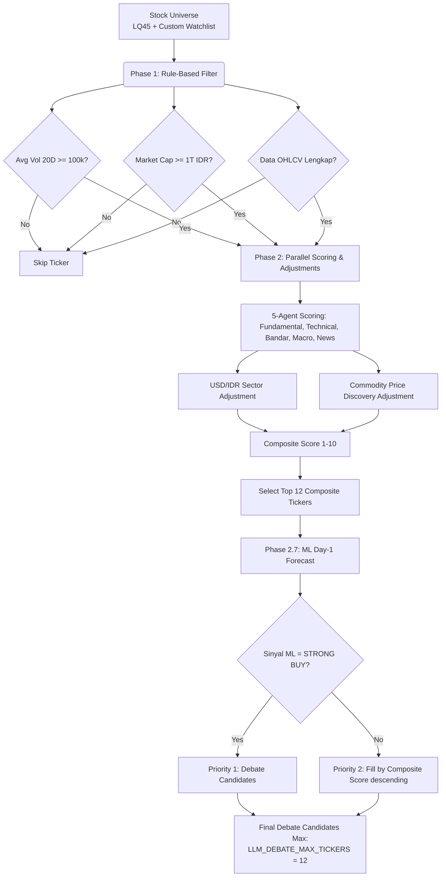

# Stock Filtering & Candidate Selection Flow

Dokumen ini menjelaskan alur lengkap penyaringan saham (*stock filtering*) dari keseluruhan *universe* saham hingga menjadi kandidat terpilih untuk debat multi-agent (*debate candidates*).

---

## 1. Visual Flow Diagram (Mermaid)

Berikut adalah diagram alir proses penyaringan saham:

---

## 2. Rincian Parameter & Ambang Batas (Thresholds)

Proses filter dibagi menjadi 3 tahapan utama dengan parameter tersendiri:

### Tahap 1: Penyaringan Awal (Rule-Based)
Penyaringan ini bertujuan menyaring saham tidak likuid atau berkapitalisasi mikro.

| Nama Parameter | Nilai Default | Variabel Konfigurasi | Deskripsi / Fungsi |
| :--- | :--- | :--- | :--- |
| **Volume Transaksi Rata-Rata** | `100.000` | `MIN_VOLUME` | Rata-rata volume harian 20 hari terakhir wajib memenuhi nilai minimum ini. |
| **Kapitalisasi Pasar** | `1.000.000.000.000` (1T IDR) | `MIN_MARKET_CAP` | Kapitalisasi pasar emiten tidak boleh di bawah nilai minimum ini. |
| **Kelengkapan Data** | Aktif / Ada | `ohlcv.empty` | File historis OHLCV dari Stockbit API harus tersedia dan lengkap. |

### Tahap 2: Pembobotan Komposit & Penyesuaian Sektoral
Mengintegrasikan analisa makro dan sektor komoditas untuk penyesuaian skor secara dinamis.

* **USD/IDR Sector Adjustment**:
  * Rupiah Melemah (USD/IDR naik > 0.5%): Sektor Energi/Bahan Baku mendapat bonus **+0.5**, sedangkan sektor konsumer/properti/bank mendapat penalti **-0.5**.
  * Rupiah Menguat (USD/IDR turun < -0.5%): Sektor Konsumer/Properti/Bank mendapat bonus **+0.5**, sedangkan sektor energi/bahan baku mendapat penalti **-0.3**.
* **Commodity Adjustment**: Bonus poin ditambahkan dinamis berdasarkan status tren harga komoditas terkait yang diekstrak dari pasar global.

### Tahap 3: Pemilihan Kandidat Debat
Tahap final penentuan saham mana saja yang masuk ke perdebatan LLM Multi-Agent.

* **Batas Maksimal Kandidat (`LLM_DEBATE_MAX_TICKERS`)**: Default `12` (bisa diatur lewat `.env`).
* **Sinyal ML**: Sinyal prediksi Machine Learning bernilai `STRONG BUY` diprioritaskan paling awal.
* **Composite Score**: Sisa kuota debat dipenuhi oleh saham dengan Composite Score tertinggi.

---

## 3. Pemetaan File & Kode Sumber

Untuk memodifikasi parameter atau menelusuri logika di atas, berikut adalah file-file penting yang terlibat:

1. **Logika Filter Awal**:
   * [data/filter.py](file:///home/hamboo/my-product/stock-agent-idx/data/filter.py) `apply_filter()` - Menyaring volume dan market cap.
2. **Definisi Nilai Threshold**:
   * [config.py](file:///home/hamboo/my-product/stock-agent-idx/config.py) - Konfigurasi variabel `MIN_VOLUME`, `MIN_MARKET_CAP`, dan `LLM_DEBATE_MAX_TICKERS`.
3. **Logika Pembobotan & Penyesuaian**:
   * [graph/scoring.py](file:///home/hamboo/my-product/stock-agent-idx/graph/scoring.py) `calculate_composite()` - Penyesuaian USD/IDR dan formula komposit.
4. **Logika Pemilihan Kandidat Debat**:
   * [agents/debate/orchestrator.py](file:///home/hamboo/my-product/stock-agent-idx/agents/debate/orchestrator.py) `run_llm_debate()` - Menyortir kandidat berdasarkan sinyal ML `STRONG BUY` dan Composite Score.
   * [graph/workflow.py](file:///home/hamboo/my-product/stock-agent-idx/graph/workflow.py) `run_debate_rule_based()` - Logika seleksi fallback (tanpa LLM).
